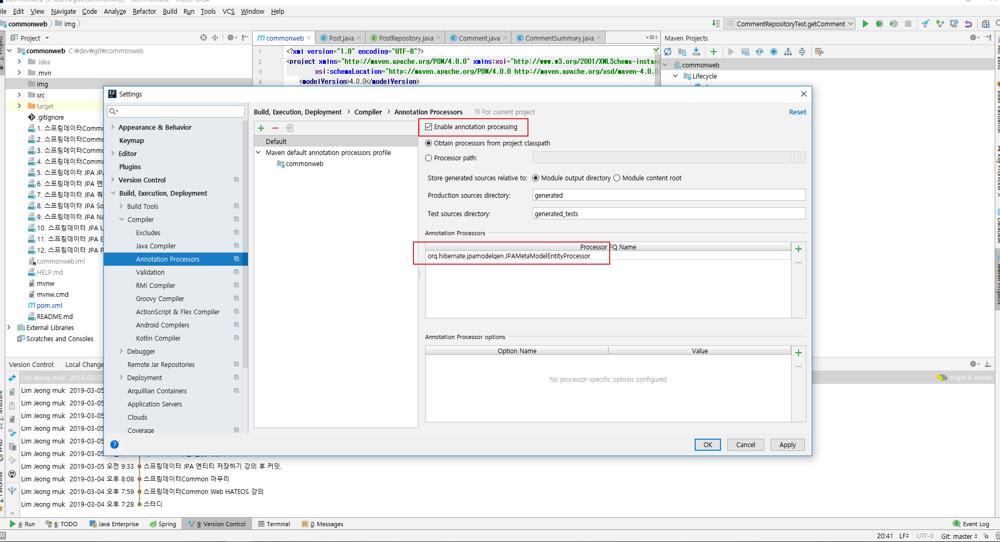

에릭 에반스의 책 DDD 에서 언급하는 Specification 개념을 차용한 것으로 QueryDSL의 Predicate 와 비슷하다.
 - 조건절을 스펙으로 정의할 수 있음.
 - 베스트 코멘트라는 스펙을 정의하고 좋아요가 10개 이상인 코멘트를 스펙으로 정의한것을 조합해서 사용을 할 수 있음.
 - OR 절로 연결을 해서 베스트이거나 좋아요가 10개이상인 코멘트.. 이런식으로 쿼리를 만들어서 실행 할 수 있다.

## 설정하는 방법
 - https://docs.jboss.org/hibernate/stable/jpamodelgen/reference/en-US/html_single/
 - 의존성 설정
 - 플러그인 설정
 - IDE에 에노테이션 처리기 설정
 - 코딩 시작

```xml
<dependency>
    <groupId>org.hibernate</groupId>
    <artifactId>hibernate-jpamodelgen</artifactId>
</dependency>
```

```xml
<plugin>
    <groupId>org.bsc.maven</groupId>
    <artifactId>maven-processor-plugin</artifactId>
    <version>2.0.5</version>
    <executions>
        <execution>
            <id>process</id>
            <goals>
                <goal>process</goal>
            </goals>
            <phase>generate-sources</phase>
            <configuration>
                <processors>
                    <processor>org.hibernate.jpamodelgen.JPAMetaModelEntityProcessor</processor>
                </processors>
            </configuration>
        </execution>
    </executions>
    <dependencies>
        <dependency>
            <groupId>org.hibernate</groupId>
            <artifactId>hibernate-jpamodelgen</artifactId>
            <version>${hibernate.version}</version>
        </dependency>
    </dependencies>
</plugin>
```

## Settings -> Build, Execution, Deployment -> Compiler -> Annotation Processors 
1. 선택 후 Enable Annotation processing 체크 
2. Processor FQ Name 에 + 선택 후 org.hibernate.jpamodelgen.JPAMetaModelEntityProcessor 입력

- 이미지
 


## 설정 후 프로젝트 클린 후 빌드(Ctrl+F9)후에 /commonweb/target/generated-sources/annotations 경로 확인

```java
package io.jmlim.commonweb.post;

import javax.annotation.Generated;
import javax.persistence.metamodel.SingularAttribute;
import javax.persistence.metamodel.StaticMetamodel;

@Generated(value = "org.hibernate.jpamodelgen.JPAMetaModelEntityProcessor")
@StaticMetamodel(Comment.class)
public abstract class Comment_ {

	public static volatile SingularAttribute<Comment, Post> post;
	public static volatile SingularAttribute<Comment, String> comment;
	public static volatile SingularAttribute<Comment, Boolean> best;
	public static volatile SingularAttribute<Comment, Long> id;
	public static volatile SingularAttribute<Comment, Integer> up;
	public static volatile SingularAttribute<Comment, Integer> down;

}
```

```java
public interface CommentRepository extends JpaRepository<Comment, Long>, JpaSpecificationExecutor<Comment> {

}
```

```java
public class CommentSpecs {
    public static Specification<Comment> isBest() {
        return (Specification<Comment>)
                (root, query, criteriaBuilder) ->
                        criteriaBuilder.isTrue(root.get(Comment_.best));
    }

    public static Specification<Comment> isGood() {
        return (Specification<Comment>)
                (root, query, criteriaBuilder) ->
                        criteriaBuilder.greaterThanOrEqualTo(root.get(Comment_.up), 10);
    }
}

```

```java
@Test
public void specs() {
    // 클라이언트가 매우 간단해짐.
    // 단 여러가지 조합이 들어갈 시 테스트를 철저히 해야한다는 점..
    Page<Comment> page = commentRepository
            .findAll(isBest().or(isGood()), PageRequest.of(0, 10));
}
```

```sql
select
     comment0_.id as id1_0_,
     comment0_.best as best2_0_,
     comment0_.comment as comment3_0_,
     comment0_.down as down4_0_,
     comment0_.post_id as post_id6_0_,
     comment0_.up as up5_0_
 from
     comment comment0_
 where
     comment0_.best=1
     or comment0_.up>=10 limit ?
```